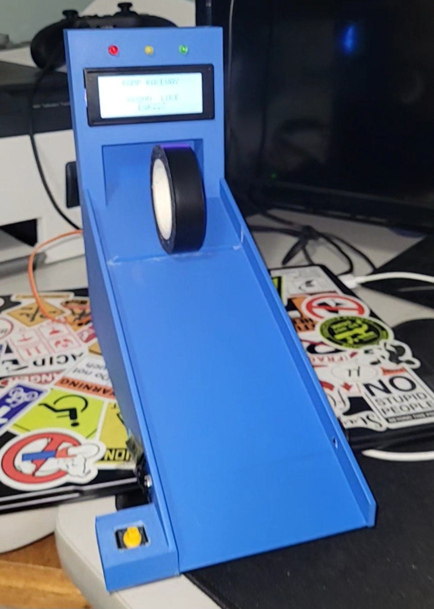

# Matchbox Car Ramp
For my final project, I designed and programmed the Matchbox Ramp Raceway, a miniature slot car drag racing system controlled by a PIC18F microcontroller. The objective was to create an interactive game that releases a matchbox car using a servo motor after a three light countdown, measures the car's race time with an infrared sensor, and displays race information on a 20x4 LCD. I implemented the project as a state machine using timers and interrupts to control the countdown sequence, servo operation, race timing, and user inputs while providing visual and audible feedback through LEDs and a piezo sounder. The system records race times over three runs, tracks the fastest time, detects false starts, and allows the user to restart the game after all races are complete. This project allowed me to apply embedded systems concepts, peripheral interfacing, and C programming to develop a complete real-time application.

# State Diagram:
The first step in this project was to make a state diagram. There are only 2 inputs that determine when the states transition aside from timer0 delays. Button #1 (BTN1) in the state diagram is clicked by the user to transition from the welcome screen to the gameplay screen, start the race, and return to the gameplay screen after the race times are displayed. The infrared sensor (IR) in the state diagram gets its signal blocked by the car at the finish line to determine when it crossed to calculate the time elapsed.

- State 0 (Welcome Screen): Displays “Ramp Raceway” and the students name and class number.
- State 1 (Gameplay Screen): Displays the race number out of three and “Click Button to Start Race”.
- State 2 (Red LED): Lights up red LED and turns on a buzzer for a half second.
- State 3 (Yellow LED): Turns off red LED, turns on yellow LED, and turns on a buzzer for a half second.
- State 4 (Green LED): Turns off yellow LED, turns on green LED, turns on a buzzer for a half second, and waits for button press to start the race.
- State 5 (Fault): This state is only entered if the user presses the push button before the light turns green and the buzzer will turn on briefly to signify a fault.
- State 6 (Race): The servo gate opens and the car starts rolling down the ramp and the next state will not be entered until the infrared sensor is blocked.  The servo is also reset.
- State 7 (Display Stats): Once the infrared sensor is blocked, the time elapsed since the light turns green is shown on the LCD screen along with the race number and best race time.
- State 8 (Restart): Once the third and final race is finished, the race number resets and the user is prompted if they want to start a new race.

